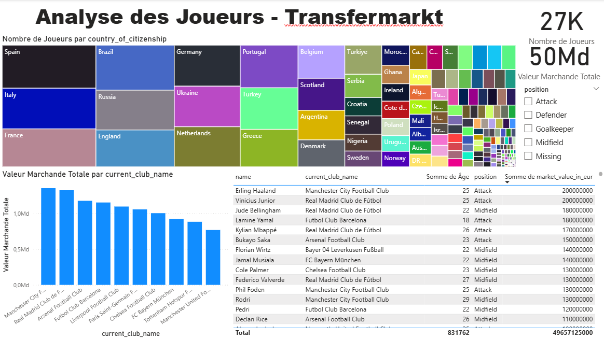
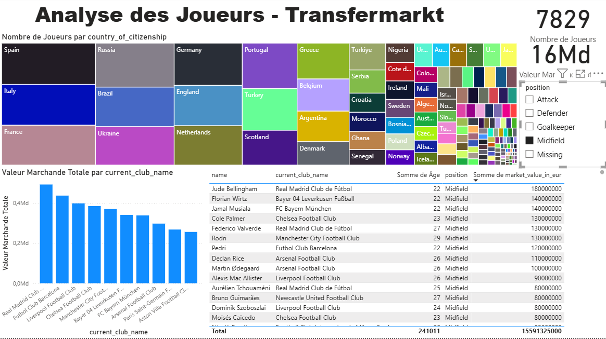

# Analyse de Joueurs de Football avec Power BI

Un dashboard interactif pour analyser les données de joueurs de football issues de Transfermarkt, développé dans le cadre de mon auto-formation sur Power BI.

*(Note : Ce projet a été développé en local avec Power BI Desktop. Les images ci-dessous présentent les fonctionnalités et les conclusions du dashboard.)*

---

## 📸 Aperçu du Dashboard Principal

---

## 🎯 Objectif du Projet

Ce projet vise à mettre en pratique l'ensemble du processus de Business Intelligence avec Power BI, du nettoyage des données à la visualisation. L'objectif était de répondre à des questions clés telles que :

*   Quels sont les clubs et les nations avec la plus grande valeur marchande ?
*   Qui sont les joueurs les plus chers du marché ?
*   Comment la valeur se répartit-elle selon les postes et l'âge des joueurs ?

---

## 🛠️ Étapes Réalisées et Compétences Mises en Œuvre

1.  **Collecte et Nettoyage des Données (Power Query) :**
    *   Importation du jeu de données CSV depuis Kaggle.
    *   Gestion des valeurs nulles, correction des types de données et sélection des colonnes pertinentes.
    *   Création de colonnes calculées (ex: calcul de l'âge à partir de la date de naissance).

2.  **Modélisation et DAX :**
    *   Création de mesures DAX claires et réutilisables pour les calculs clés (Valeur Marchande Totale, Nombre de Joueurs, etc.).

3.  **Visualisation et Storytelling :**
    *   Conception d'un rapport dynamique avec des histogrammes, des treemaps et des tableaux.
    *   Mise en place de filtres et de segments pour permettre une exploration interactive des données. **(Voir exemple ci-dessous)**

---

## ✨ Exemple d'interactivité : Focus sur les "Millieux de terrains"

Pour démontrer les capacités de filtrage du dashboard, voici une vue du rapport lorsqu'il est filtré pour n'afficher que les joueurs en position "Midfield".

*(Cette image montre comment tous les visuels (Top Clubs, Nationalités, Tableau des joueurs) se mettent à jour dynamiquement pour ne refléter que les données relatives aux millieux de terrain.)*

---

## 📂 Contenu du Dépôt

*   `.pbix` : Le fichier source du projet Power BI (nécessite Power BI Desktop pour être ouvert).
*   `.png` : Les captures d'écran des dashboards
*   `/images` : Un dossier contenant les captures d'écran du dashboard.
*   `README.md` : Ce fichier de présentation.
